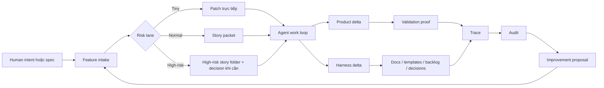
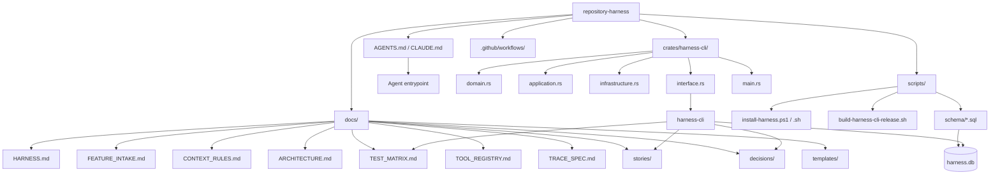
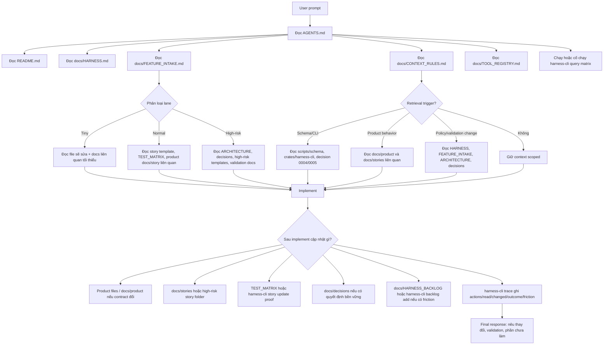

# Báo cáo: Harness For Coding Agent trong `repository-harness`

Ngày scan: 2026-06-14  
Workspace: `E:\Projects\harness-tubakhuym`

## Tóm Tắt

Repo này không phải một ứng dụng sản phẩm. Đây là một **repository harness**: bộ khung vận hành đặt trong repo để coding agent có thể hiểu việc cần làm, phân loại rủi ro, tìm nguồn sự thật, chạy hoặc ghi nhận bằng chứng, và để lại tri thức cho lần làm việc tiếp theo.

Ý tưởng cốt lõi: **app là thứ người dùng chạm vào; harness là thứ agent chạm vào**. Harness biến một repo từ tập hợp file code/docs thành một môi trường làm việc có quy trình, bộ nhớ, công cụ, bằng chứng và audit trail.

Trạng thái thực tế trên máy này:

- Repo có đầy đủ docs, templates, Rust CLI source, schema migrations, installer và GitHub workflows.
- Binary bắt buộc `scripts/bin/harness-cli.exe` không có trong checkout hiện tại.
- `cargo` không có trên `PATH`, nên không thể build/chạy CLI từ source trong phiên này.
- `git status` bị chặn bởi lỗi `dubious ownership` nếu chạy bình thường; dùng `git -c safe.directory=E:/Projects/harness-tubakhuym status --short` thì thành công.

## Khái Niệm: Harness For Coding Agent

Trong ngữ cảnh coding agent, **harness** là lớp vận hành bao quanh model và repository. Nó không chỉ là prompt. Nó gồm quy tắc, file hướng dẫn, bộ nhớ dữ liệu, công cụ, validation, permission, quan sát và feedback loop giúp agent biết:

- Cần đọc gì trước?
- Đây là loại việc nào?
- Rủi ro nằm ở đâu?
- Hợp đồng sản phẩm nào bị ảnh hưởng?
- Bằng chứng nào chứng minh việc đã xong?
- Điều gì cần ghi lại để agent sau không phải suy luận lại?

Bài OpenAI “Harness engineering: leveraging Codex in an agent-first world” mô tả cùng một hướng: con người steering, agent execution; repo phải trở thành system of record; `AGENTS.md` nên là mục lục ngắn, còn tri thức chi tiết nằm trong docs có cấu trúc; architecture, lint/test và observability cần được encode để agent tự kiểm chứng.

Harness khác với:

- **Agent framework**: framework là thứ lập trình agent; harness là cách repo được chuẩn bị để agent làm việc đúng.
- **Test harness**: test harness chủ yếu chạy kiểm thử; coding-agent harness bao gồm intake, context, permission, memory, tool access, validation, trace và audit.
- **Một file prompt lớn**: harness có nhiều artifact có thể truy vấn, kiểm tra, update và version.

Nguồn tham khảo:

- OpenAI, “Harness engineering: leveraging Codex in an agent-first world”, 2026-02-11: https://openai.com/index/harness-engineering/
- `README.md`
- `docs/HARNESS.md`
- `docs/FEATURE_INTAKE.md`
- `docs/CONTEXT_RULES.md`
- `docs/TOOL_REGISTRY.md`

## Sơ Đồ Mermaid: Vòng Đời Công Việc



## Sơ Đồ Mermaid: Kiến Trúc Repo



## Sơ Đồ Mermaid: Agent Được Guide Đọc Và Cập Nhật Markdown Như Thế Nào



Ý nghĩa của sơ đồ:

- `AGENTS.md` là entrypoint, không phải nơi chứa toàn bộ hướng dẫn.
- `FEATURE_INTAKE.md` quyết định lane và mức overhead cần dùng.
- `CONTEXT_RULES.md` quyết định agent phải đọc thêm file nào theo phase và trigger.
- Markdown product/story/decision là nguồn truth có version; `harness.db` là record vận hành local.
- Sau implement, agent không chỉ sửa code. Nó phải cân nhắc cập nhật story, proof, decision, backlog và trace.

## Mục Đích Của Project

`repository-harness` nhằm “turn any software repo into an agent-ready workspace”. Nó cung cấp một bộ file và CLI để cài vào repo khác, giúp human và agent biến ý định hoặc spec thành các work item an toàn hơn.

Repo này hiện là Harness v0/source repo, không có product implementation:

- Không có app source scaffolding.
- Không có stack sản phẩm bị khóa.
- Không có product contract cụ thể ngoài placeholder `docs/product/README.md`.
- Không có validation script sản phẩm như `validate:quick`, `test:e2e`, v.v.

Mục đích chính là reusable operating layer:

- `AGENTS.md`: entrypoint ngắn cho agent.
- `docs/HARNESS.md`: operating model và task loop.
- `docs/FEATURE_INTAKE.md`: phân loại input type và lane `tiny` / `normal` / `high-risk`.
- `docs/CONTEXT_RULES.md`: quy định context nào cần đọc theo phase/lane.
- `docs/ARCHITECTURE.md`: nguyên tắc boundary/layering cho app tương lai.
- `docs/TEST_MATRIX.md`: mapping story -> proof.
- `docs/stories/`: work packets và backlog lịch sử.
- `docs/decisions/`: ADR/durable decisions.
- `scripts/schema/`: SQLite durable-layer schema.
- `crates/harness-cli/`: Rust CLI implementation.
- `scripts/install-harness.*`: installer cho target repo.

## Setup Chuẩn Theo Repo

### Cài Harness Vào Một Repo Khác

Windows PowerShell:

```powershell
& ([scriptblock]::Create((irm "https://raw.githubusercontent.com/hoangnb24/repository-harness/main/scripts/install-harness.ps1"))) -Yes
```

Nếu repo đã có `AGENTS.md`, `docs/`, hoặc `scripts/`, dùng merge:

```powershell
& ([scriptblock]::Create((irm "https://raw.githubusercontent.com/hoangnb24/repository-harness/main/scripts/install-harness.ps1"))) -Merge -Yes
```

Installer sẽ:

- Đặt hoặc merge `AGENTS.md`, `docs/`, `scripts/`.
- Tải prebuilt Rust CLI đúng platform vào `scripts/bin/harness-cli` hoặc `scripts/bin/harness-cli.exe`.
- Verify checksum `.sha256`.
- Tôn trọng `--dry-run`, `--merge`, `--override`, `--refresh-agent-shim`, `--claude`.

### Khởi Tạo Durable Layer

Sau khi có binary:

```powershell
.\scripts\bin\harness-cli.exe init
.\scripts\bin\harness-cli.exe import brownfield
.\scripts\bin\harness-cli.exe query matrix
```

`harness.db` là local database, bị `.gitignore`, không commit. Schema nằm trong `scripts/schema/`.

### Setup Source Repo Để Phát Triển CLI

Cần Rust toolchain/Cargo:

```powershell
cargo fmt --check
cargo test --workspace
cargo run -p harness-cli -- --version
```

Release packaging:

- Source version hiện tại: `crates/harness-cli/Cargo.toml` là `0.1.10`.
- Pin release: `scripts/harness-cli-release-tag` là `harness-cli-v0.1.10`.
- Workflow `.github/workflows/harness-cli-release.yml` build 5 artifact: macOS arm64/x64, Linux x64/arm64, Windows x64.
- Workflow `.github/workflows/post-merge-maintenance.yml` cập nhật `CHANGELOG.md`, bump patch version và tạo release tag khi CLI/schema/package thay đổi.

## Setup Thực Tế Trên Workspace Này

Đã kiểm tra:

- `scripts/bin/harness-cli.exe`: không tồn tại.
- `cargo`: không có trên `PATH`.
- `harness.db`: không thấy trong file list.
- `docs/TEST_MATRIX.md`: chỉ có placeholder `TBD`.
- `git -c safe.directory=E:/Projects/harness-tubakhuym status --short`: trước khi tạo report không có output.

Hệ quả:

- Không thể chạy lệnh bắt buộc `.\scripts\bin\harness-cli.exe query matrix`.
- Không thể record `intake`/`trace` bằng CLI.
- Không thể verify Rust test suite trong phiên này.

Đây là **setup gap**, không phải thiết kế gap: source và installer đều mong binary prebuilt được download/cài vào `scripts/bin`.

## Cấu Trúc Repository

Quét bằng `rg --files --hidden -g '!/.git/**'` cho thấy các nhóm chính:

```text
root
  AGENTS.md
  CLAUDE.md
  README.md
  PHASE2.md ... PHASE5.md
  Cargo.toml / Cargo.lock
  crates/harness-cli/
  docs/
  scripts/
  .github/
```

Thống kê docs:

- `docs/`: 15 file trực tiếp.
- `docs/decisions/`: 8 file.
- `docs/stories/`: 20 file trực tiếp.
- `docs/stories/epics/`: 3 epic folders/areas với progress/high-risk story docs.
- `docs/templates/`: 4 template trực tiếp.
- `docs/templates/high-risk-story/`: 4 template.

## Cách Thức Hoạt Động

### 1. Agent Entrypoint

`AGENTS.md` là shim ngắn. Nó bắt agent đọc:

- `README.md`
- `docs/HARNESS.md`
- `docs/FEATURE_INTAKE.md`
- `docs/ARCHITECTURE.md`
- `docs/CONTEXT_RULES.md`
- `docs/TOOL_REGISTRY.md`
- `scripts/bin/harness-cli query matrix`

Với Claude Code, `CLAUDE.md` import `AGENTS.md` và `docs/FEATURE_INTAKE.md` để runtime đó nhìn thấy harness.

### 2. Intake Gate

Mọi prompt đi qua `docs/FEATURE_INTAKE.md`.

Input types:

- New spec
- Spec slice
- Change request
- New initiative
- Maintenance request
- Harness improvement

Lane:

- **Tiny**: docs/copy/narrow changes, setup nhỏ.
- **Normal**: story-sized behavior có blast radius giới hạn.
- **High-risk**: security, data, auth, authorization, public contracts, external systems, multi-domain, weak proof.

CLI tương ứng:

```powershell
.\scripts\bin\harness-cli.exe intake --type "harness improvement" --summary "..." --lane normal
```

### 3. Context Selection

`docs/CONTEXT_RULES.md` quy định đọc gì theo phase:

- Intake
- Planning
- Implementation
- Validation
- Trace

Nó cũng có retrieval triggers. Ví dụ:

- Đụng schema/durable records -> đọc decision `0004-sqlite-durable-layer.md`, `scripts/schema/`, CLI code.
- Đụng CLI/installer -> đọc `0005-prebuilt-rust-harness-cli.md`, `scripts/README.md`, CLI source/help.
- Đụng auth/security/data loss -> high-risk lane.

CLI có `score-context <trace-id>` để chấm lại trace đã đọc đủ context chưa.

### 4. Story Và Proof Matrix

Normal/high-risk work tạo story packet:

- Normal dùng `docs/templates/story.md`.
- High-risk dùng folder `docs/templates/high-risk-story/` gồm `overview.md`, `design.md`, `execplan.md`, `validation.md`.

Story được lưu trong SQLite table `story` với các proof flags:

- `unit_proof`
- `integration_proof`
- `e2e_proof`
- `platform_proof`
- `evidence`
- `verify_command`
- `last_verified_result`

`query matrix` đọc table `story` và render ra matrix.

### 5. Agent Work Loop

Flow trong `docs/HARNESS.md`:

```text
Human intent
  -> Feature intake
  -> Story packet
  -> Agent work loop
  -> Product delta
  -> Validation proof
  -> Harness delta
  -> Next intent
```

Mỗi task có thể tạo:

- **Product delta**: code, tests, API, data model, product docs.
- **Harness delta**: docs, templates, validation expectations, backlog, decisions, traces.

### 6. Durable Layer

Schema chính trong `scripts/schema/001-init.sql`:

- `schema_version`
- `intake`
- `story`
- `decision`
- `backlog`
- `trace`

Migrations thêm:

- `002-story-verify.sql`: thêm `verify_command`, `last_verified_at`, `last_verified_result` cho story.
- `003-tool-registry.sql`: table `tool`.
- `004-intervention.sql`: table `intervention`.
- `005-tool-extensions.sql`: `kind`, `capability`, `scan_target`, `status`, `checked_at` cho inbound tool registry.

Rust CLI layout theo decision 0005:

- `domain.rs`: value types, lane/type parsing, trace/context scoring, compiled tool registry.
- `application.rs`: service/use-case layer.
- `infrastructure.rs`: SQLite repository, migrations, imports, verification, audit/propose.
- `interface.rs`: Clap CLI commands và terminal output.
- `main.rs`: parse CLI và run.

### 7. Tool Registry

`docs/TOOL_REGISTRY.md` tách 2 loại tool:

- **Outbound/compiled**: command mà `harness-cli` expose sẵn.
- **Inbound/registered**: tool dự án đang có, ví dụ linter, deploy check, MCP, skill, HTTP health endpoint.

Đăng ký inbound tool:

```powershell
.\scripts\bin\harness-cli.exe tool register `
  --name deploy-check `
  --kind cli `
  --capability deploy-verification `
  --command .\scripts\deploy-check.ps1 `
  --description "Verify deploy health before release" `
  --responsibility Verification
```

Kiểm tra presence:

```powershell
.\scripts\bin\harness-cli.exe tool check
.\scripts\bin\harness-cli.exe query tools --capability deploy-verification --status present
```

Degrade ladder:

- No providers registered: inactive, clean skip.
- Registered but missing: degraded, weak proof flag.
- All present: full operation.

### 8. Verification

Story verification:

```powershell
.\scripts\bin\harness-cli.exe story add --id US-012 --title "..." --lane normal --verify "cargo test --workspace"
.\scripts\bin\harness-cli.exe story verify US-012
.\scripts\bin\harness-cli.exe story verify-all
```

`verify_story` chạy command trong repo root qua shell, ghi pass/fail vào database. `trace --story` cảnh báo nếu story có verify command nhưng chưa pass.

Release verification trên GitHub:

- `cargo fmt --check`
- `cargo test --workspace`
- `bash -n scripts/install-harness.sh`
- `bash -n scripts/build-harness-cli-release.sh`
- Smoke `dist/harness-cli-* --help` và `score-trace --help`.

### 9. Trace, Audit, Propose

`docs/TRACE_SPEC.md` định nghĩa trace tiers:

- **Minimal**: summary + outcome.
- **Standard**: thêm agent, actions, files read/changed, errors/friction.
- **Detailed**: thêm decisions, explicit errors/friction, duration/tokens hoặc note.

`audit` tìm drift:

- Orphaned planned/in-progress stories.
- Unverified story commands.
- Unverified decision commands.
- Implemented backlog items thiếu actual outcome.
- Stale unfinished stories.
- Broken registered tools.

Entropy score:

```text
orphaned_stories * 10
+ unverified_stories * 5
+ unverified_decisions * 5
+ backlog_without_outcomes * 2
+ stale_stories * 3
+ broken_tools * 8
cap 100
```

`propose` tạo improvement proposals từ:

- repeated friction,
- repeated interventions,
- audit findings.

`propose --commit` tạo backlog items ở status `proposed`.

## Điểm Mạnh

- Repo encode được operating model thay vì dựa vào chat history.
- Có source hierarchy rõ: prompt/spec -> product docs -> stories -> matrix -> decisions.
- Có durable layer bằng SQLite thay vì sửa markdown table fragile.
- CLI có typed parsing bằng Clap và tested domain/infrastructure code trong source.
- Tool registry có degrade model, phù hợp môi trường agent khác nhau.
- Trace/audit/propose tạo feedback loop để harness tiến hóa từ friction thực tế.
- Installer có chiến lược merge/override/refresh shim và binary checksum.

## Khoảng Trống Và Rủi Ro Hiện Tại

- Binary `scripts/bin/harness-cli.exe` không có, trong khi `AGENTS.md` yêu cầu dùng nó làm tool chính.
- Máy này không có Cargo, nên không thể build source CLI để thay thế.
- Không có `harness.db`, nên durable records/intake/trace/matrix runtime chưa khả dụng.
- Docs maturity nói H2/H4 achieved dựa trên CLI, nhưng checkout source không tự đảm bảo binary present.
- Product contract còn rỗng; repo chưa thể hướng dẫn implement sản phẩm cụ thể cho đến khi có spec.
- Permission enforcement chủ yếu là instruction-level, chưa có enforce layer.
- Observability/failure attribution một phần vẫn advisory, chưa có dashboard/benchmark ingestion.

## Cách Đưa Workspace Này Về Trạng Thái Dùng Được

Lựa chọn 1: cài binary prebuilt theo installer/pin release.

```powershell
& ([scriptblock]::Create((irm "https://raw.githubusercontent.com/hoangnb24/repository-harness/main/scripts/install-harness.ps1"))) -Merge -Yes
```

Lựa chọn 2: cài Rust toolchain rồi build/chạy CLI từ source.

```powershell
cargo test --workspace
cargo run -p harness-cli -- init
cargo run -p harness-cli -- import brownfield
cargo run -p harness-cli -- query matrix
```

Lựa chọn 3: nếu đây là source repo và muốn tạo release artifact local, dùng release script trên môi trường có Bash/Rust:

```bash
scripts/build-harness-cli-release.sh
```

## Kết Luận

Project này là một bộ **agent operating system cấp repository**. Nó đặt tri thức, quy trình, memory, validation và audit vào repo để coding agent làm việc có thể kiểm chứng hơn. Phần thiết kế khá đầy đủ: intake, context, stories, decisions, durable SQLite, CLI, registry, verification, trace, audit và proposal loop.

Điểm cần sửa trước khi dùng thực tế trên workspace này là cài được `scripts/bin/harness-cli.exe` hoặc Rust/Cargo để chạy CLI từ source.

File HTML minh họa cấu trúc: `harness-structure.html`.
